---
title: Práctica de diseño de protocolos P2P
subtitle: Redes de Comunicaciones
author:
    - Mourad Abbou Aazaz G2.1
    - Pablo José Rocamora Zamora G2.2
date: Febrero 24, 2017
header: dsad
footer: So is this
geometry: margin=1in
toc: true
toc-depth: 2
fontsize: 11pt # puede ser 10, 11 o 12
fontfamily: lmodern
documentclass: scrartcl
---


# Introducción.

Este documento contiene el diseño del protocolo Peer - Tracker y Peer - Peer que hemos llevado acabo durante el curso académico 2016/17.


## Resumen de los paquetes UDP: peer - tracker que usamos:

#### Formato del mensaje: CONTROL

Tipos que lo usan:

- Type = 1 (ADD_SEED_ACK)
- Type = 10 (REMOVE_SEED_ACK)

#### Formato del mensaje: FILEINFO


Tipos que lo usan:

- Type = 2 (ADD_SEED)
- Type = 6 (QUERY_FILES_RESPONSE)


#### Formato del mensaje: SEEDINFO

Tipos que lo usan:

- Type = 3 (GET_SEEDS)
- Type = 4 (SEED_LIST)


#### Formato del mensaje: SEEDQUERY

Tipos que lo usan:

- Type = 5 (QUERY_FILES)


#### Formato del mensaje: CHUNKINFO

Tipos que lo usan:

- Type = 7 (QUERY_CHUNK)
- Type = 8 (QUERY_CHUNK_RESPONSE)


#### Formato del mensaje: REMOVE

Tipos que lo usan:

- Type = 9 (REMOVE_SEED)


## Resumen de los paquetes TCP: peer - peer que usamos:

#### Formato del mensaje: CHUNKQUERY

Tipos que lo usan:

- Type = 1 (GET_CHUNK)
- Type = 3 (CHUNK)


#### Formato del mensaje: CHUNKQUERYRESPONSE

Tipos que lo usan:

- Type = 2 (GET_CHUNK_RESPONSE)
- Type = 4 (CHUNK_RESPONSE)


\newpage

# Autómatas de ambos protocolos:

## Peer-peer: Autómata unificado

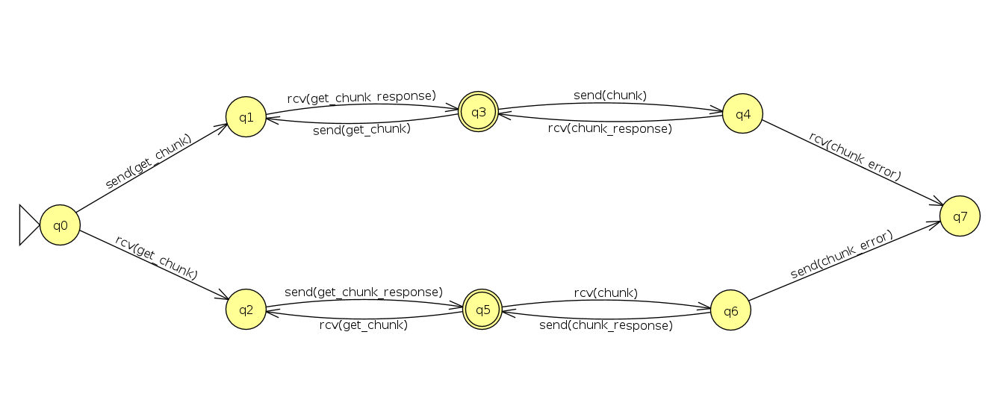

El autómata del Peer para la conexión cliente - servidor entre distintos Peer es bastante simple:

1. El peer hace de cliente y pide la lista de chunks a un fichero, cuando recibe la lista de chunks puede terminar, volver a pedir la lista de chunks para actualizarla o empezar a pedir los datos de los chunks uno a uno.
2. El peer hace de servidor y recibe una solicitud de lista de chunks de un fichero, cuando envía la lista de chunks puede terminar, volver a enviar la lista de chunks para actualizarla o empezar a enviar los datos de los chunks uno a uno.
3. Cuando un peer solicita un chunk a otro peer servidor que lo contenía, y por factores externos el peer servidor ya no lo contiene o se ha desconectado, se notifica un mensaje de error.

\newpage

## Peer-tracker: Cliente y servidor

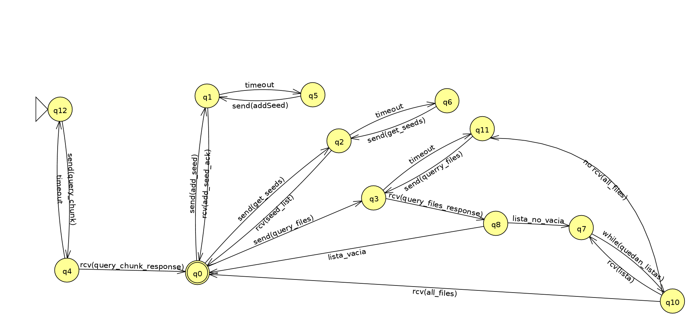

El autómata del peer para la conexión del peer con el tracker es un poco mas complejo, ya que es el que lleva toda el control de los estados para así poder hacer que el autómata del servidor sea muy simple:

1. En cada comunicación con el Tracker el Peer lo primero que solicita es el tamaño de chunk, una vez que tiene ese dato puede hacer el resto de consultas.
2. Envía un *add_seed*, si no recibe respuesta y pasa el *timeout* el peer vuelve a retransmitir el mensaje hasta que obtenga respuesta. Al
   recibir una respuesta comprueba que hay mas trozos por enviar. En ese caso vuelve a enviar un un *add_seed, hasta que no hayan mas trozos por enviar.
3. Envía un *get_seeds*, si no recibe respuesta y pasa el *timeout* el peer vuelve a retransmitir el mensaje hasta que obtenga respuesta.
4. Envía un *query_files*, si no recibe respuesta y pasa el *timeout* el peer vuelve a retransmitir el mensaje hasta que obtenga respuesta. Si obtiene respuesta pueden pasar 2 opciones diferentes:
    - Es una lista vacía, este caso es correcto ya que no hay ningún fichero que satisface los criterios de búsqueda.
    - La lista contiene ficheros, se mete en un bucle en el que esperaremos recibir el mismo numero de paquetes que indica un campo del paquete, si al terminar de recibir todos los paquetes he recibido el numero de paquetes esperado, finalizo correctamente, por el contrario si no he recibido todos los paquetes o hay un *timeout* de algún paquete vuelvo a enviar el paquete *query_files* para solicitar todos los paquetes de nuevo.
5. Envía un *remove_seed*, si no recibe respuesta y pasa el *timeout* el peer vuelve a retransmitir el mensaje hasta que obtenga respuesta.

\pagebreak


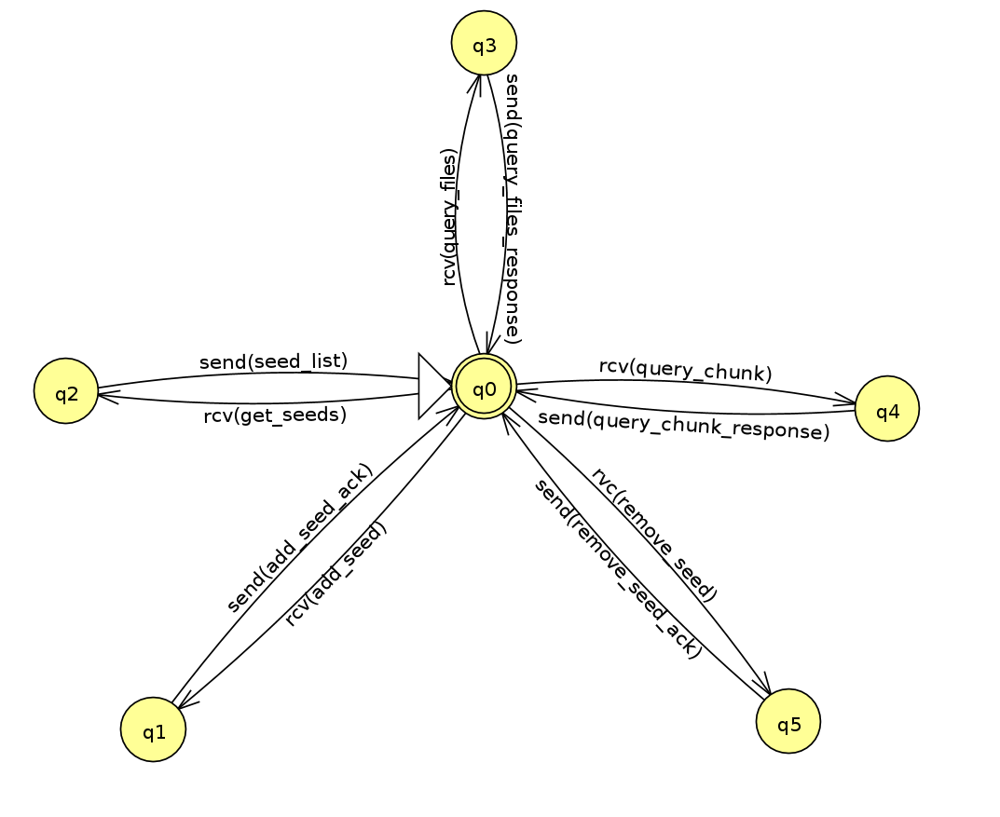


El autómata de conexión del tracker es muy simple ya que solo se encarga de responder las solicitudes de los clientes, si su paquete no llega sera el Peer el que se encargue de volver a pedir la información:

1. Cuando recibe un *add_seed* responde con un *add_seed_ack*.
2. Cuando recibe un *get_seeds* responde con un *seed_list*.
3. Cuando recibe un *query_files* responde con un *query_files_response*.
4. Cuando recibe un *query_chunk* responde con un *query_chunk_response*.
5. Cuando recibe un *remove_seed* responde con un *remove_seed_ack*.


\newpage

# Formato de representación de los mensajes

## Peer-peer


### Formato del mensaje: CHUNKQUERY para el tipo GET_CHUNK

- Type = 1 (GET_CHUNK)
    - Formato del mensaje: CHUNKQUERY.
    - Un Peer solicita al otro Peer la lista de Chunks que tiene de un determinado fichero, que indica a través de su Hash.


<!--
<table>
    <tr align="center">
        <td>Type (1 byte)</td>
        <td>Hash (20 bytes)</td>
    </tr>
    <tr align="center">
        <td colspan="2">Num Chunks (longitud variable)</td>
    </tr>
</table>
-->

Información del paquete:

- Type: Siempre sera 1 para indicar que es un GET_CHUNK.
- Hash: Hash del fichero del que deseamos saber los chunks disponibles.
- Num Chunks: No se usa, todo a 0.


### Formato del mensaje: CHUNKQUERYRESPONSE para el tipo GET_CHUNK_RESPONSE

- Type = 2 (GET_CHUNK_RESPONSE)
    - Formato del mensaje: CHUNKQUERYRESPONSE.
    - Un Peer informa a otro Peer de la lista de chunks que tiene de un determinado fichero.

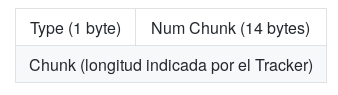

<!--
<table>
    <tr align="center">
        <td>Type (1 byte)</td>
        <td>Hash (20 bytes)</td>
    </tr>
    <tr align="center">
        <td>Num Chunk (longitud variable)</td>
        <td>Chunk (longitud indicada por el tracker)</td>
    </tr>
</table>
-->


Información del paquete:

- Type: Siempre sera 2 para indicar que es un GET_CHUNK_RESPONSE.
- Hash: Hash del fichero del que nos está informando.
- Num Chunks: Numero de chunks que tiene para compartir. El tamaño del campo lo obtenemos con la fórmula: (sale abajo)[^1], Si se tienen todos los chunks de un fichero este campo irá todo a 1 para indicarlo.
- Chunk: Chunks que tiene el peer, se repite n veces, siendo n: Num Chunks.


[^1]: $\log_2 \frac{Tamaño Máximo De Un fichero = 2^{32}}{Tamaño De Chunks}$


### 3.1 Ejemplo.

#### Un peer A solicita al otro peer B la lista de chunks que tiene de un fichero ubuntu14.04.iso (hash b9153318862f0f7b5f82c913ecb2117f97c3153e, tamaño 1.024.572.864 bytes)

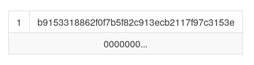

<!--
<table>
    <tr align="center">
        <td>1</td>
        <td>b9153318862f0f7b5f82c913ecb2117f97c3153e</td>
    </tr>
    <tr align="center">
        <td colspan="2">0000000...</td>
    </tr>
</table>
-->


#### Un peer B informa a otro peer A de la lista de chunks que tiene de un determinado fichero listo para compartir ubuntu14.04.iso (hash b9153318862f0f7b5f82c913ecb2117f97c3153e, tamaño 1.024.572.864 bytes)

Le responde que tiene 4 chunks del fichero solicitado (1, 3, 4, 5)


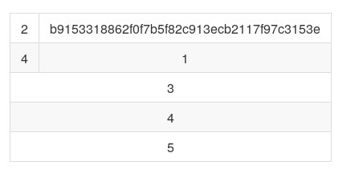

<!--
<table>
    <tr align="center">
        <td>2</td>
        <td>b9153318862f0f7b5f82c913ecb2117f97c3153e</td>
    </tr>
    <tr align="center">
        <td>4</td>
        <td>1</td>
    </tr>
    <tr align="center">
        <td colspan="2">3</td>
    </tr>
    <tr align="center">
        <td colspan="2">4</td>
    </tr>
    <tr align="center">
        <td colspan="2">5</td>
    </tr>
</table>
-->


### Formato del mensaje: CHUNKQUERY para el tipo CHUNK

- Type = 3 (CHUNK)
    - Formato del mensaje: CHUNKQUERY.
    - Un Peer solicita al otro Peer un Chunk de un fichero específico indicado a través de su Hash.


<!--
<table>
    <tr align="center">
        <td>Type (1 byte)</td>
        <td>Hash (20 bytes)</td>
    </tr>
    <tr align="center">
        <td colspan="2">Num Chunks (longitud variable)</td>
    </tr>
</table>
-->

\pagebreak

Información del paquete:

- Type: Siempre será 3 para indicar que es un CHUNK.
- Hash: Hash del fichero del que deseamos obtener un chunk.
- Num Chunks: Número del chunk del fichero que solicita.


### Formato del mensaje: CHUNKQUERYRESPONSE para el tipo CHUNK_RESPONSE

- Type = 4 (CHUNK_RESPONSE)
    - Formato del mensaje: CHUNKQUERYRESPONSE.
    - Un Peer manda a otro Peer el chunk que le ha solicitado.


<!--
<table>
    <tr align="center">
        <td>Type (1 byte)</td>
        <td>Hash (20 bytes)</td>
    </tr>
    <tr align="center">
        <td>Num Chunk (longitud variable)</td>
        <td>Chunk (longitud indicada por el Tracker)</td>
    </tr>
</table>
-->

Información del paquete:

- Type: Siempre sera 4 para indicar que es un CHUNK_RESPONSE.
- Hash: Hash del fichero del que procede el chunk.
- Num Chunk: Número del chunk del que procede el dato.
- Chunk: Dato del chunk, el tamaño se establece acorde al tamaño que nos indica el Tracker.


#### Un peer A solicita al otro peer B el chunk 30 del fichero ubuntu14.04.iso (hash b9153318862f0f7b5f82c913ecb2117f97c3153e, tamaño 1.024.572.864 bytes)


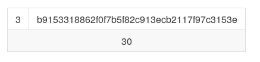

\pagebreak

<!--
<table>
    <tr align="center">
        <td>3</td>
        <td>b9153318862f0f7b5f82c913ecb2117f97c3153e</td>
    </tr>
    <tr align="center">
        <td colspan="2">30</td>
    </tr>
</table>
-->


#### El peer B manda el dato del chunk 30 a el peer A del fichero ubuntu14.04.iso (hash b9153318862f0f7b5f82c913ecb2117f97c3153e, tamaño 1.024.572.864 bytes)


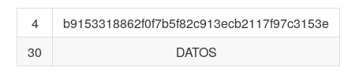

<!--
<table>
    <tr align="center">
        <td>4</td>
        <td>b9153318862f0f7b5f82c913ecb2117f97c3153e</td>
    </tr>
    <tr align="center">
        <td>30</td>
        <td>DATOS</td>
    </tr>
</table>
-->


\newpage

## Peer-tracker

### Formato del mensaje: CONTROL para el tipo  ADD_SEED_ACK

- Type = 1 (ADD_SEED_ACK)
    - Formato del mensaje: CONTROL.
    - El Tracker confirma con ACK que ha recibido la solicitud ADD_SEED de un Peer para unirse a la red P2P.

```xml
<message>
    <operation>add_seed_ack</operation>
</message>
```

Información del paquete:

- Type: Siempre sera 1 o add_seed_ack para indicar que es un ADD_SEED_ACK.


### Formato del mensaje: FILEINFO para el tipo ADD_SEED

- Type = 2 (ADD_SEED)
    - Formato del mensaje: FILEINFO.
    - Un Peer solicita al Tracker unirse a la red compartiendo una serie de ficheros. Si la lista de ficheros no cabe en un único paquete se partirá en los paquetes que sean necesarios, por cada paquete que se envíe se esperara un ACK y cuando llegue ese ACK se mandará el siguiente paquete. También es usado mas tarde por el Peer para añadir ficheros conforme quiera compartirlos.

```xml
<message>
    <operation>add_seed</operation>
    <port></port>
    <paquetes></paquetes>
    <file>
        <name></name>
        <size></size>
        <hash></hash>
    </file>
</message>
```

Información del paquete:

- Type: Siempre sera 2 o add_seed para indicar que es un ADD_SEED.
- Port: Indica el puerto por el que escuchara el peer.
- Paquetes: Número de ficheros que mandamos al tracker.
- Filename: Nombre del fichero, se repetirá n veces.
- Size: Tamaño del fichero en bytes, se repetirá n veces.
- Hash: Hash del fichero, se repetirá n veces.


### Formato del mensaje: SEEDINFO para el tipo GET_SEEDS

- Type = 3 (GET_SEEDS)
    - Formato del mensaje: SEEDINFO.
    - Un Peer solicita al Tracker la lista de semillas para un fichero, para indicar que fichero es usara el Hash del fichero.

```xml
<message>
    <operation>get_seeds</operation>
    <hash></hash>
    </message>
```

Información del paquete:

- Type: Siempre sera 3 o get_seeds para indicar que es un GET_SEEDS.
- Hash: Hash del fichero del que deseamos obtener los Seeds.


### Formato del mensaje: SEEDINFO para el tipo SEED_LIST

- Type = 4 (SEED_LIST)
    - Formato del mensaje: SEEDINFO.
    - Un Tracker informa al Peer de la lista de semillas del fichero solicitado a través de su Hash.

```xml
<message>
    <operation>seed_list</operation>
    <hash></hash>
    <size></size>
    <seeds>
        <ip></ip>
        <port></port>
    </seeds>
</message>
```

Información del paquete:

- Type: Siempre sera 4 o seed_list para indicar que es un SEED_LIST.
- Hash: Hash del fichero del que obtenemos los Seeds.
- Size: Tamaño del fichero en bytes.
- IP: IP del peer que tiene trozos del fichero, se repetirá n veces.
- Port: Puerto que tiene a la escucha el peer que tiene trozos del fichero, se repetirá n veces.


### 1.1. Usando mensajes multiformato un peer (155.54.2.3) se agrega como seed en el puerto 4533, y con los ficheros:

- ubuntu14.04.iso (hash b9153318862f0f7b5f82c913ecb2117f97c3153e, tamaño 1.024.572.864 bytes)
- android-studio.zip (hash af09cc0a33340d8daccdf3cbfefdc9ab45b97b5d , tamaño 380.943.097 bytes).

#### El peer envía al tracker un mensaje FILEINFO tipo ADD_SEED

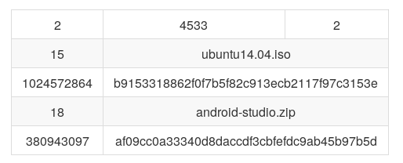

\pagebreak

<!--
<table>
    <tr align="center">
        <td>2</td>
        <td>4533</td>
        <td>2</td>
    </tr>
    <tr align="center">
        <td>15</td>
        <td colspan="3">ubuntu14.04.iso</td>
    </tr>
    <tr align="center">
        <td>1024572864</td>
        <td colspan="3">b9153318862f0f7b5f82c913ecb2117f97c3153e</td>
    </tr>
    <tr align="center">
        <td>18</td>
        <td colspan="3">android-studio.zip</td>
    </tr>
    <tr align="center">
        <td>380943097</td>
        <td colspan="3">af09cc0a33340d8daccdf3cbfefdc9ab45b97b5d</td>
    </tr>
</table>
-->

#### El tracker responde con un mensaje de CONTROL tipo ADD_SEED_ACK


<!--
<table>
    <tr align="center">
        <td>1</td>
    </tr>
</table>
-->


### 1.2. Usando un lenguaje de marcas especificar la comunicación del apartado 1.1

#### El peer envía al tracker un mensaje FILEINFO tipo ADD_SEED

```xml
<message>
    <operation>add_seed</operation>
    <port>4533</port>
    <paquetes>1</paquetes>
    <file>
        <name>ubuntu14.04.iso</name>
        <size>1024572864</size>
        <hash>b9153318862f0f7b5f82c913ecb2117f97c3153e</hash>
    </file>
    <file>
        <name>android-studio.zip</name>
        <size>380943097</size>
        <hash>af09cc0a33340d8daccdf3cbfefdc9ab45b97b5d</hash>
    </file>
</message>
```


#### El tracker responde con un mensaje de CONTROL tipo ADD_SEED_ACK

```xml
<message>
    <operation>add_seed_ack</operation>
</message>
```


### Formato del mensaje: SEEDQUERY para el tipo QUERY_FILES

- Type = 5 (QUERY_FILES)
    - Formato del mensaje: SEEDQUERY.
    - Un Peer solicita al Tracker la lista de ficheros que coinciden con su patrón de búsqueda. Podemos buscar por tamaño, nombre o ambas, para tamaño tenemos varios operadores aritméticos.

```xml
<message>
    <operation>query_files</operation>
    <op></op>
    <file>
        <size></size>
        <name></name>
    </file>
</message>
```

Información del paquete:

- Type: Siempre será 5 o query_files para indicar que es un QUERY_FILES.
- Op: Operador de condición para tamaño: *(podemos usar operadores bash: gt, lt, ge, etc)*
    - 0: >
    - 1: >=
    - 2: <
    - 3: <=
    - 4: Aprox (10Mb) (EXTRA)
- Size: Tamaño del fichero que estamos buscando en bytes, si no lo usamos todo a 0.
- Filename: nombre del fichero que buscamos, si no lo usamos todo a 0.


### Formato del mensaje: FILEINFO para el tipo QUERY_FILES_RESPONSE

- Type = 6 (QUERY_FILES_RESPONSE)
    - Formato del mensaje: FILEINFO.
    - El tracker lista los ficheros que coinciden con su patrón de búsqueda. Si la lista de ficheros no cabe en un único paquete se partirá en los paquetes que sean necesarios, y se enviarán todos, el Peer tendrá que comprobar si se han recibido todos los paquetes, sino se han recibido volverá a hacer la solicitud.

```xml
<message>
    <operation>query_files_response</operation>
    <paquetes></paquetes>
    <file>
        <name></name>
        <size></size>
        <hash></hash>
    </file>
</message>
```

Información del paquete:

- Type: Siempre será 6 o query_files_response para indicar que es un QUERY_FILES_RESPONSE.
- Paquetes: Número de paquetes que se van a enviar, normalmente será 1.
- Filename: nombre del fichero, se repetirá n veces.
- Size: Tamaño del fichero en bytes, se repetirá n veces.
- Hash: Hash del fichero, se repetirá n veces.


### Formato del mensaje: CHUNKINFO para el tipo QUERY_CHUNK

- Type = 7 (QUERY_CHUNK)
    - Formato del mensaje: CHUNKINFO.
    - El Peer pregunta al Tracker cuál es el tamaño de los chunks. Este mensaje será el primero que se mande para iniciar la comunicación con el Tracker.

```xml
<message>
    <operation>query_chunk</operation>
</message>
```

Información del paquete:

- Type: Siempre será 7 para indicar que es un QUERY_CHUNK.


### Formato del mensaje: CHUNKINFO para el tipo QUERY_CHUNK_RESPONSE

- Type = 8 (QUERY_CHUNK_RESPONSE)
    - Formato del mensaje: CHUNKINFO.
    - El Tracker responde al Peer cuál es el tamaño de los chunks.

```xml
<message>
    <operation>query_chunk_response</operation>
    <size></size>
</message>
```

Información del paquete:

- Type: Siempre será 8 para indicar que es un QUERY_CHUNK_RESPONSE.
- Tamaño Chunk: Indica el tamaño del chunk.


### Formato del mensaje: REMOVE para el tipo REMOVE_SEED

- Type = 9 (REMOVE_SEED)
    - Formato del mensaje: REMOVE.
    - El Peer informa al Tracker de que quiere hacer una solicitud de borrado, hay 2 opciones:
        - Darse de baja como peer: si queremos dejar de ser un Peer activo pondremos el Hash todo a 1.
        - Dar de baja un fichero: Si solo queremos borrar un fichero de la lista de activos pondremos el Hash del fichero.

```xml
<message>
    <operation>remove_seed</operation>
    <port></port>
    <hash></hash>
</message>
```


Información del paquete:

- Type: Siempre sera 9 o remove_seed para indicar que es un REMOVE_SEED.
- Port: Indica el puerto del peer.
- Hash: Hash del fichero al que damos de baja o todo a 1.


### Formato del mensaje: CONTROL para el tipo REMOVE_SEED_ACK

- Type = 10 (REMOVE_SEED_ACK)
    - Formato del mensaje: CONTROL.
    - El Tracker confirma que ha recibido la solicitud de un Peer para borrar al Peer o a un fichero.

```xml
<message>
    <operation>remove_seed_ack</operation>
</message>
```


Información del paquete:

- Type: Siempre será 10 o remove_seed_ack para indicar que es un REMOVE_SEED_ACK.


### 2.1. Usando mensajes multiformato el peer solicita un QUERY_FILES al tracker y éste responde con la lista de archivos correspondiente.

- ubuntu14.04.iso (hash b9153318862f0f7b5f82c913ecb2117f97c3153e, tamaño 1.024.572.864 bytes)
- android-studio.zip (hash af09cc0a33340d8daccdf3cbfefdc9ab45b97b5d , tamaño 380.943.097 bytes).


#### El peer envía al track un mensaje SEED_QUERY_FILES tipo QUERY_FILES para buscar los ficheros de tamaño superior o igual a 250000 bytes

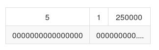

<!--
<table>
    <tr align="center">
        <td>5</td>
        <td>1</td>
        <td>250000</td>
    </tr>
    <tr align="center">
        <td>0000000000000000</td>
        <td colspan="2">000000000....</td>
    </tr>
</table>
-->


#### El tracker le responde con un mensaje FILEINFO tipo QUERY_FILES_RESPONSE con los ficheros de tamaño superior a 250000 bytes

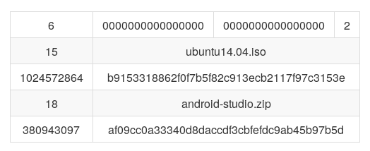

\pagebreak

<!--
<table>
    <tr align="center">
        <td>6</td>
        <td>0000000000000000</td>
        <td>0000000000000000</td>
        <td>2</td>
    </tr>
    <tr align="center">
        <td>15</td>
        <td colspan="3">ubuntu14.04.iso</td>
    </tr>
    <tr align="center">
        <td>1024572864</td>
        <td colspan="3">b9153318862f0f7b5f82c913ecb2117f97c3153e</td>
    </tr>
    <tr align="center">
        <td>18</td>
        <td colspan="3">android-studio.zip</td>
    </tr>
    <tr align="center">
        <td>380943097</td>
        <td colspan="3">af09cc0a33340d8daccdf3cbfefdc9ab45b97b5d</td>
    </tr>
</table>
-->


### 2.2. Usando lenguaje de marcas especificar la comunicación del apartado 2.1.


#### Peer informa a tracker con un mensaje SEEDQUERY:


```xml
<message>
    <operation>query_files</operation>
    <op>1</op> <!--podemos usar operadores bash: gt, lt, ge, etc-->
    <file>
        <size>250000</size>
        <name></name>
    </file>
</message>
```


#### El tracker responde con un mensaje FILEINFO:

```xml
<message>
    <operation>query_files_response</operation>
    <num_seq></num_seq>
    <port></port>
    <file>
        <name>ubuntu14.04.iso</name>
        <size>1024572864</size>
        <hash>b9153318862f0f7b5f82c913ecb2117f97c3153e</hash>
    </file>
    <file>
        <name>android-studio.zip</name>
        <size>380943097</size>
        <hash>af09cc0a33340d8daccdf3cbfefdc9ab45b97b5d</hash>
    </file>
</message>
```


#### El Peer pregunta al Tracker el tamaño de los chunks

```xml
<message>
    <operation>query_chunk</operation>
</message>
```

#### El Tracker responda al peer con el tamaño


```xml
<message>
    <operation>query_chunk_response</operation>
    <size>1500</size>
</message>
```


#### El peer elimina un fichero de la lista del tracker


```xml
<message>
    <operation>remove_seed</operation>
    <port>9541</port>
    <hash>af09cc0a33340d8daccdf3cbfefdc9ab45b97b5d</hash>
</message>
```

#### El tracker confirma la eliminación


```xml
<message>
    <operation>remove_seed_ack</operation>
</message>
```

#### El peer se da de baja como peer activo de la lista del tracker


```xml
<message>
    <operation>remove_seed</operation>
    <port>9541</port>
    <hash>11111111111111111111111111111111111111111</hash>
</message>
```

#### El tracker confirma la eliminación


```xml
<message>
    <operation>remove_seed_ack</operation>
</message>
```

### Errores que pueden surgir durante las comunicaciones:

1. Un peer se desconecte sin avisar al tracker: en ese caso el peer que detecte al peer desconectado deberá informar al tracker para que le dé de baja.
2. Un peer deje de tener un fichero que estaba compartiendo: en este caso tendrá que mandar al tracker un *remove* del fichero que ya no tiene.


\newpage

# Conclusiones

El diseño esta completo, aunque se le podrían añadir algunas mejoras en los paquetes para aumentar la funcionalidad del tracker y de los peers.
