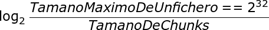

## 3. Puesto los peers pueden servir trozos de un fichero aunque no lo hayan descargado por completo, es necesario que un peer averigüe qué trozos pueden obtener de otro peer. Diseña los mensajes para dicha consulta y la correspondiente respuesta. Diseño los mensajes necesarios para solicitar y servir los trozos del fichero.

#### Formato del mensaje: CHUNKQUERY para el tipo GET_CHUNK

- Type = 1 (GET_CHUNK)
    - Formato del mensaje: CHUNKQUERY
    - Un peer solicita al otro peer la lista de chunks que tiene de un determinado fichero

<table>
    <tr align="center">
        <td>Type (1 byte)</td>
        <td>Hash (20 bytes)</td>
    </tr>
    <tr align="center">
        <td colspan="2">Num Chunks (longitud variable)</td>
    </tr>
</table>

Información del paquete:

- Type: Siempre sera 1 para indicar que es un GET_CHUNK.
- Hash: Hash del fichero del que deseamos saber los chunks disponibles, puede que en vez del nombre del fichero podamos poner el Hash del fichero ya que evitaría fallos por nombre duplicado.
- Num Chunks: No se usa, todo a 0.

#### Formato del mensaje: CHUNKQUERYRESPONSE para el tipo GET_CHUNK_RESPONSE

- Type = 2 (GET_CHUNK_RESPONSE)
    - Formato del mensaje: CHUNKQUERYRESPONSE
    - Un peer informa a otro peer de la lista de chunks que tiene de un determinado fichero listo para compartir.

<table>
    <tr align="center">
        <td>Type (1 byte)</td>
        <td>Hash (20 bytes)</td>
    </tr>
    <tr align="center">
        <td>Num Chunks (longitud variable)</td>
        <td>Chunk (X bytes)</td>
    </tr>
</table>

Información del paquete:

- Type: Siempre sera 2 para indicar que es un GET_CHUNK_RESPONSE.
- Hash: Hash del fichero del que nos esta informando.
- Num Chunks: Numero de chunks que tiene para compartir, El tamaño lo obtenemos con la formula: (sale abajo), Si se tienen todos los chunks de un fichero este campo ira todo a 1 para indicarlo.
- Chunk: Chunks que tiene el peer, se repite n veces, siendo n: Num Chunks.

<!--[^1]: $\log_2 \frac{Tamano Maximo De Un fichero = 2^{32}}{Tamano De Chunks}$-->

### 3.1 Ejemplo.

#### Un peer A solicita al otro peer B la lista de chunks que tiene de un fichero ubuntu14.04.iso (hash b9153318862f0f7b5f82c913ecb2117f97c3153e, tamaño 1.024.572.864 bytes)

<table>
    <tr align="center">
        <td>1</td>
        <td>b9153318862f0f7b5f82c913ecb2117f97c3153e</td>
    </tr>
    <tr align="center">
        <td colspan="2">0000000...</td>
    </tr>
</table>

#### Un peer B informa a otro peer A de la lista de chunks que tiene de un determinado fichero listo para compartir ubuntu14.04.iso (hash b9153318862f0f7b5f82c913ecb2117f97c3153e, tamaño 1.024.572.864 bytes)

Le responde que tiene 4 chunks del fichero solicitado (1, 3, 4, 5)

 
 
 

<table>
    <tr align="center">
        <td>2</td>
        <td>b9153318862f0f7b5f82c913ecb2117f97c3153e</td>
    </tr>
	<tr align="center">
        <td>4</td>
        <td>1</td>
    </tr>
    <tr align="center">
        <td colspan="2">3</td>
    </tr>
    <tr align="center">
        <td colspan="2">4</td>
    </tr>
    <tr align="center">
        <td colspan="2">5</td>
    </tr>
</table>
